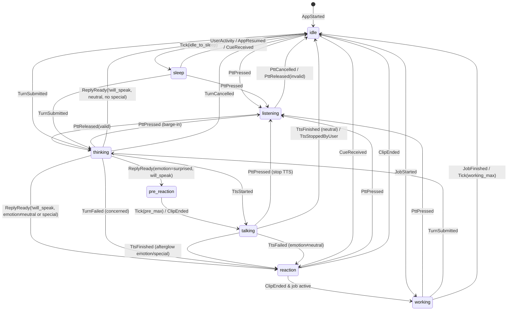

# HANA — CHARACTER SYSTEM

Phiên bản: 1.2 (Phase 1 + Final Decision Patch + Phase 3.2 Asset Policy Patch) · Vị trí canonical: `repo/docs/` · Quyết định chốt: ARCHITECTURE §0.1 (D8)
Phụ thuộc: `ARCHITECTURE.md` (C2, C3, C8, C15, INV-02, INV-03, INV-05, INV-16, INV-17, INV-18, INV-21, INV-22), `AI_PROTOCOL.md` §5, `PRIVACY_SPEC.md` §4.1, §5.6, `PHASE_3_2_ASSET_POLICY_PATCH.md`.

> Phase 3.2: thay mô hình `mode: normal|private` / `category=private` của asset bằng hai trục tách biệt `content_sensitivity` và `allowed_modes`, thêm Owner Asset Policy, stage context `daily|assistant|relationship|private`, và cho phép nhiều CoreState dùng chung asset pool. Toàn bộ 43 video nguồn được giữ trong thư viện.

---

## 1. Mục tiêu và ranh giới

Character System biến *ý nghĩa* (Hana đang nghe, đang nghĩ, đang vui, đang ngại…) thành *hình ảnh* (clip video có sẵn), mà không để LLM hay server chạm vào file.

| Phần | Vị trí | Input | Output | KHÔNG ĐƯỢC |
|---|---|---|---|---|
| **Character Director** | Backend (`app/domain/character/director.py`) | Envelope LLM đã validate, kết quả action, zone, sự kiện hệ thống, cờ relationship của owner policy | `CharacterCue` (enum thuần, gồm `stage_context`) | Biết asset_id/filename/sensitivity; đọc manifest; đọc override theo asset |
| **Character Engine** | Flutter (`lib/character/engine/`) | `CharacterCue`, sự kiện app (PTT, TTS, turn, lifecycle, thời gian), manifest, owner policy | `Play(asset_id, …)` gửi VideoStage | Nhận asset_id/filename từ mạng/LLM; normal engine đọc private_vault manifest; bật âm thanh video |
| **Asset Policy Engine** | Flutter (`lib/character/policy/`), hàm thuần dùng bởi Engine | manifest + owner policy + `(state_or_cue, stage_context)` | danh sách candidate đã lọc + trọng số (§11) | I/O; ngẫu nhiên không inject; quyết định dựa trên dữ liệu từ LLM ngoài enum cue |
| **VideoStage** | Flutter (`lib/character/stage/`) | `PlayRequest` | Pixel trên màn hình | Tự chọn asset; phát audio |
| **Asset Pipeline** | Windows dev (`tools/asset_pipeline/`) | `assets_source/*.MP4` (read-only) + `labels.yaml` | File app-ready muted + manifest theo delivery | Ghi vào `assets_source` |

**Nguyên tắc chốt:**

1. LLM chỉ được chọn `emotion` ∈ {neutral, happy, shy, surprised, concerned}, `intensity` ∈ {low, medium, high}, `special_cue` ∈ danh sách semantic cue được phép hoặc `null` (INV-02). LLM **không** chọn `stage_context`.
2. Các state hoạt động `listening`, `talking`, `thinking`, `working`, `sleep`, `idle` **không bao giờ** do LLM quyết định; chúng đến từ sự kiện app thật (INV-02).
3. Asset được chọn **chỉ** trên client bởi Character Engine qua Asset Policy Engine, từ manifest đã verify (INV-21).
4. Mọi video app-ready không có audio stream; mọi player volume 0 (INV-03). Giọng Hana chỉ từ TTS.
5. `content_sensitivity` mô tả nội dung và quyết định **cách phân phối/bảo vệ**; `allowed_modes` + owner policy quyết định **được hiển thị ở đâu**. Hai trục không suy ra nhau.

---

## 2. Từ vựng (enum chốt, dùng nguyên văn trong code)

### 2.1 CoreState (10)

| CoreState | Loại | Nguồn kích hoạt | Clip kind mong muốn |
|---|---|---|---|
| `idle` | activity (nền) | mặc định | loop |
| `listening` | activity | PTT đang giữ | loop |
| `talking` | activity | TTS đang phát | loop |
| `thinking` | activity | turn đã gửi, chưa có reply | loop |
| `happy` | emotion | cue emotion=happy | oneshot (reaction) hoặc loop ngắn |
| `shy` | emotion | cue emotion=shy | oneshot |
| `surprised` | emotion | cue emotion=surprised | oneshot |
| `concerned` | emotion | cue emotion=concerned, lỗi hệ thống | oneshot |
| `working` | activity | job dài do người dùng yêu cầu đang chạy | loop |
| `sleep` | activity | quiet hours + idle, hoặc idle rất lâu | loop |

"Clip kind mong muốn" là ưu tiên, không phải yêu cầu coverage: một CoreState **không bắt buộc** có asset riêng; nhiều CoreState CÓ THỂ dùng chung một asset pool (§4.2 `states`), thiếu thì fallback (§11.3).

### 2.2 Emotion (LLM được phép chọn)

`neutral | happy | shy | surprised | concerned` — `neutral` không có clip riêng, nghĩa là "không reaction".

### 2.3 Intensity

`low | medium | high`.

### 2.4 SpecialCue

Chuỗi semantic `snake_case` khớp regex `^[a-z][a-z0-9_]{1,31}$`, đăng ký trong `cue_registry` (§4.4). Không phải filename. Tên cue PHẢI trung tính, không mô tả nội dung nhạy cảm (tên cue có thể xuất hiện trong prompt LLM). Ứng viên hiện tại: `greeting`, `playful`, `goodnight`, `celebrate`, `comfort` (chốt ở Phase 4).

### 2.5 StageContext (trục hiển thị — `allowed_modes` dùng enum này)

| StageContext | Zone | Ý nghĩa | Nguồn |
|---|---|---|---|
| `daily` | normal | Mặc định: idle, trò chuyện thường, chào sáng/hỏi thăm | mặc định engine; Director |
| `assistant` | normal | Hana đang làm việc: nhắc việc, task, nhật ký, báo cáo, chỉ thị, job dài | Director (action/sự kiện nghiệp vụ); engine khi `working` |
| `relationship` | normal | Trò chuyện tình cảm; chỉ tồn tại khi owner bật `relationship_stage_enabled` | Director theo owner policy (§8.5) |
| `private` | private | Mọi thứ trong private session | private engine (luôn luôn) |

Zone (`normal | private`) vẫn là ranh giới cách ly dữ liệu của PRIVACY_SPEC; StageContext chỉ là ngữ cảnh chọn hình ảnh.

### 2.6 ContentSensitivity

`normal < suggestive < private` (rank 0, 1, 2). Nhãn mô tả nội dung, gán ở `labels.yaml`. Thiếu nhãn → `private` (fail-closed).

### 2.7 Delivery (suy ra, không gán tay)

```
delivery(a) = private_vault  nếu allowed_modes(a) == [private]
            = bundle         nếu content_sensitivity(a) == normal
            = vault          còn lại
```

| Delivery | Nơi ở | Truy cập |
|---|---|---|
| `bundle` | APK (`repo/mobile/assets/character/bundle/`) | luôn có |
| `vault` | server `ASSET_VAULT_ROOT` | JWT normal, cache mã hóa trên thiết bị (PRIVACY_SPEC §4.1) |
| `private_vault` | server `PRIVATE_MEDIA_ROOT/assets/` | chỉ private session (PRIVACY_SPEC §5.6) |

### 2.8 TechnicalQuality, cờ duyệt

- `technical_quality`: `good | fair | poor`.
- `review_flag`: bool — asset cần người duyệt thêm; vẫn dùng được, weight thấp hơn, không làm loop chính (§11.2).
- `excluded_by_default`: bool — asset được publish nhưng không eligible cho đến khi owner bật lại (§17).
- `hard_block`: bool — chỉ dành cho nội dung vi phạm giới hạn tuyệt đối (PRIVACY_SPEC §10.1); không publish, owner không bật lại được.

---

## 3. Dữ liệu nguồn hiện có (khảo sát read-only 2026-09-15, phân loại Phase 3)

`assets_source/` chứa **43** file `.MP4`, đặt tên ngẫu nhiên, không mang nghĩa.

| Nhóm | Độ phân giải | Tỉ lệ | Thời lượng | Số file | Seed `content_sensitivity` (Phase 3.2) |
|---|---|---|---|---|---|
| A | 544×544 | 1:1 | 6.04 s | 17 | `suggestive` (provisional — owner xác nhận ở Phase 4) |
| B | 720×1280 | 9:16 | 10.04 s | 14 | `private` |
| C | 768×1168 | ~2:3 | 10.04 s | 12 | `private` |

Tất cả: H.264, 24 fps, **có audio AAC stereo** (phải loại bỏ), **có stream mjpeg attached picture** (phải loại bỏ).

Hệ quả thiết kế:

- Pipeline PHẢI xóa audio stream và attached picture (§5.2).
- Stage PHẢI hỗ trợ nhiều tỉ lệ bằng `render_mode` theo asset (§5.4).
- Không có asset `content_sensitivity=normal` ⇒ `bundle` hiện rỗng (chỉ có `fallback.png`); toàn bộ video đi qua `vault`.
- Seed policy từng clip (asset_id, sensitivity, allowed_modes, quality, review_flag, pools): `PHASE_3_2_ASSET_POLICY_PATCH.md` §7.

---

## 4. Asset model & pipeline

### 4.1 Luồng

```
assets_source/*.MP4  (IMMUTABLE, read-only)
      │ probe.py  (ffprobe, sha256)                         → asset_analysis/probe.json
      │ contact sheet (chỉ để người duyệt)                   → asset_analysis/sheets/
      ▼
asset_analysis/labels.yaml  (v2, người duyệt điền; seed từ Phase 3.2)
      │ label_check.py  (schema + sha256 + asset_id registry + coverage REPORT)
      ▼                                                      → asset_analysis/coverage_report.json
transcode.py  (ffmpeg, §5.2)          → assets_processed/{bundle,vault,private_vault}/…
      ▼
verify.py  (ffprobe: 0 audio, 1 video stream, codec, duration; sha256 output)
      ▼
manifest.py                            → assets_processed/bundle_manifest.json
                                          assets_processed/vault_manifest.json
                                          assets_processed/private_vault_manifest.json
      ├─► sync_bundle (copy)             → repo/mobile/assets/character/bundle/
      ├─► publish_vault.py (scp/rsync)   → server ASSET_VAULT_ROOT/
      └─► publish_private.py             → server PRIVATE_MEDIA_ROOT/assets/ (chỉ private_vault)
```

Pipeline mở file nguồn ở chế độ đọc; `verify.py` so sha256 của toàn bộ `assets_source` trước và sau khi chạy, khác → fail (INV-16).

### 4.2 `labels.yaml` v2 (người duyệt điền)

```yaml
version: 2
assets:
  - asset_id: chr_018                  # ^chr_\d{3}$, ổn định, không bao giờ tái sử dụng
    source_file: JEPK9717.MP4
    source_sha256: "…"                 # phải khớp probe.json
    content_sensitivity: suggestive    # normal | suggestive | private ; thiếu → private
    sensitivity_source: phase3_group_provisional   # phase3 | phase3_group_provisional | owner_confirmed
    allowed_modes: [daily, assistant, relationship, private]   # ⊆ StageContext, không rỗng; thiếu → [private]
    hard_block: false                  # chỉ true khi vi phạm PRIVACY_SPEC §10.1
    technical_quality: good            # good | fair | poor
    review_flag: false
    excluded_by_default: false
    states:                            # CoreState → primary | shared ; có thể {} nếu chỉ dùng qua cue
      idle: primary
      listening: shared
      talking: shared
    cues: []                           # SpecialCue
    intensity_tags: []                 # tùy chọn; emotion states dùng để khớp intensity
    kind: loop                         # playback_kind: loop | oneshot
    loop_quality: crossfade            # seamless | crossfade
    trim_start_ms: 0
    trim_end_ms: 0
    render_mode: contain_blur          # cover | contain_blur
    focal_x: 0.5
    focal_y: 0.35
    weight: 1.0                        # 0.05..10
    notes: "…"
cues:
  - cue: greeting
    allowed_modes: [daily, relationship, private]
    cooldown_s: 600
    allowed_in_quiet_hours: false
    llm_selectable: false
```

Quy tắc `label_check.py`:

| Tình huống | Kết quả |
|---|---|
| File trong `assets_source` không có entry | loại, cảnh báo (INV-17) |
| Schema sai, sha256 lệch, `asset_id` trùng hoặc tái sử dụng id đã retire, state/cue lạ, `allowed_modes` rỗng | **exit ≠ 0** (build fail) |
| Thiếu `content_sensitivity` / `allowed_modes` | dùng `private` / `[private]`, cảnh báo |
| `hard_block: true` | không transcode/publish; bắt buộc có `notes` |
| `review_flag: true`, `technical_quality: poor`, `excluded_by_default: true` | **vẫn** transcode + publish (không loại) |
| Asset không thuộc state nào và không có cue | cảnh báo "unused" (Phase 3.2 yêu cầu 43/43 có ít nhất 1 pool hoặc cue) |
| Coverage: một (StageContext, CoreState) có 0 candidate / 0 main-loop | **chỉ cảnh báo** trong `coverage_report.json`; **không** fail build (engine dùng fallback §11.3) |

Không còn `decision: include|reject`, `mode`, `class`, `coverage_waiver` (thay bằng các trường trên). Pipeline không tự suy luận sensitivity.

### 4.3 Asset ID và đường dẫn

- `asset_id` = `chr_{nnn}` (3 chữ số), opaque: không mã hóa state, mode, sensitivity hay tên nguồn. Registry `asset_analysis/asset_id_registry.json` giữ ánh xạ `asset_id ↔ source_sha256` và id đã retire.
- File: `assets_processed/{delivery}/{asset_id}.mp4`, poster `{asset_id}.poster.jpg`, poster mờ `{asset_id}.blur.jpg`.
- Tên file nguồn **chỉ** xuất hiện trong `asset_analysis/` và tài liệu dev (không ship, không vào DB, không vào prompt). Manifest ship không chứa tên nguồn.

### 4.4 Manifest schema (v2)

Ba manifest cùng schema, khác `manifest_kind`:

```json
{
  "schema_version": 2,
  "manifest_kind": "vault",
  "manifest_version": "2026.09.15-2",
  "generated_at": "2026-09-15T08:00:00Z",
  "cue_registry": [
    { "cue": "greeting", "allowed_modes": ["daily", "relationship", "private"], "cooldown_s": 600, "allowed_in_quiet_hours": false, "llm_selectable": false }
  ],
  "assets": [
    {
      "asset_id": "chr_018",
      "delivery": "vault",
      "content_sensitivity": "suggestive",
      "allowed_modes": ["daily", "assistant", "relationship", "private"],
      "technical_quality": "good",
      "review_flag": false,
      "excluded_by_default": false,
      "states": { "idle": "primary", "listening": "shared", "talking": "shared" },
      "cues": [],
      "kind": "loop",
      "loop_quality": "crossfade",
      "path": "vault/chr_018.mp4",
      "poster": "vault/chr_018.poster.jpg",
      "poster_blur": "vault/chr_018.blur.jpg",
      "duration_ms": 6042,
      "width": 544, "height": 544,
      "render_mode": "contain_blur",
      "focal_x": 0.5, "focal_y": 0.35,
      "intensity_tags": [],
      "weight": 1.0,
      "audio_streams": 0,
      "sha256": "…",
      "bytes": 2345678
    }
  ]
}
```

Ràng buộc validate (pipeline và client khi load; vi phạm bất kỳ → từ chối **toàn bộ** manifest, log critical, dùng fallback):

| `manifest_kind` | Mọi asset phải thỏa |
|---|---|
| `bundle` | `delivery=bundle` và `content_sensitivity=normal` |
| `vault` | `delivery=vault`, `content_sensitivity ∈ {suggestive, private}`, `allowed_modes ∩ {daily, assistant, relationship} ≠ ∅` |
| `private_vault` | `delivery=private_vault`, `allowed_modes == [private]` |

- Normal engine chỉ load `bundle` + `vault`; nhận manifest `private_vault` → từ chối (CHR-04, INV-05).
- `audio_streams` PHẢI = 0 (INV-03). Asset khác → client bỏ qua asset đó.
- `path`/`poster`/`poster_blur` khớp `^(bundle|vault|private_vault)/chr_\d{3}(\.poster|\.blur)?\.(mp4|jpg)$`, prefix trùng `delivery`.
- `cue_registry[].allowed_modes` ⊆ StageContext; `llm_selectable = true` nghĩa là cue có thể được đưa vào danh sách cho LLM chọn (AI_PROTOCOL §5.3).
- Không có trường `hard_block`, `source_file`, `notes`, `sensitivity_source` trong manifest ship.

### 4.5 Phân phối

| Manifest | Nơi ở | Cách client nhận |
|---|---|---|
| bundle | `repo/mobile/assets/character/bundle/` (APK) | `rootBundle` lúc khởi động |
| vault | server `ASSET_VAULT_ROOT/vault_manifest.json` | `GET /v1/assets/manifest` (JWT); file qua `GET /v1/assets/{asset_id}` (+`/poster`, `/blur`) |
| private_vault | server `PRIVATE_MEDIA_ROOT/assets/private_vault_manifest.json` | `GET /v1/private/assets/manifest` (private session) |

- Server giữ bản sao **cue registry** (không asset) cho Director và AI Protocol: `MEDIA_ROOT/character/normal_cues.json` (cue có `allowed_modes ∩ {daily, assistant, relationship} ≠ ∅`) và `PRIVATE_MEDIA_ROOT/assets/private_cues.json` (cue có `private ∈ allowed_modes`). Pipeline sinh cùng lúc với manifest.
- `bundle_manifest.json` commit vào repo; build script (`mobile/tool/check_assets.dart`) fail nếu file bundle thiếu, sha256 lệch, hoặc có asset `content_sensitivity ≠ normal`.
- Vault manifest có thể được republish mà không cần build APK mới; client so `manifest_version` (ETag) khi bootstrap/resume và tải asset mới/đổi sha256 ở nền.

### 4.6 Vault & private_vault assets

- Asset `content_sensitivity ≥ suggestive` **không bao giờ** nằm trong `repo/mobile/assets/` (INV-05). CI quét APK/AAB: có entry `vault/`, `private_vault/`, hoặc asset nào ngoài `bundle_manifest.json` → fail build.
- Server lưu vault tại `ASSET_VAULT_ROOT`, private_vault tại `PRIVATE_MEDIA_ROOT/assets/`; không có static route.
- Client lưu cache mã hóa: vault → PRIVACY_SPEC §4.1; private_vault → PRIVACY_SPEC §5.6.

---

## 5. Media handling rules

### 5.1 Quy tắc tuyệt đối

| # | Quy tắc |
|---|---|
| M1 | File app-ready có **đúng 1 stream**, loại video, codec H.264. Không audio, không subtitle, không data, không attached picture. |
| M2 | Metadata nguồn bị xóa (`-map_metadata -1`, `-map_chapters -1`). |
| M3 | Không upscale. Không thay đổi fps (24). |
| M4 | Mọi `VideoPlayerController` tạo với `VideoPlayerOptions(mixWithOthers: true)` và gọi `setVolume(0.0)` **trước** `play()`. |
| M5 | Không có code path nào gọi `setVolume` với giá trị khác 0. Test grep trong CI. |
| M6 | Âm thanh duy nhất của Hana là TTS qua `just_audio` (VOICE_SPEC). |
| M7 | Video không giữ audio focus; phát TTS không bị video làm gián đoạn và ngược lại. |
| M8 | Không phát file ngoài manifest đã validate. |
| M9 | Asset vault chỉ tồn tại dạng giải mã trong `cache/vault_rt/` (normal engine) hoặc `cache/prv_rt/` (private engine); private_vault chỉ trong `cache/prv_rt/` khi private session mở. |
| M10 | Mọi quy tắc M1–M9 áp dụng như nhau cho mọi `content_sensitivity`, mọi `delivery`, kể cả asset `review_flag`/`poor`/`excluded_by_default`. |

### 5.2 Transcode (ffmpeg, chốt tham số)

```
ffmpeg -hide_banner -y -i <source> \
  -map 0:v:0 -an -sn -dn -map_metadata -1 -map_chapters -1 \
  [-ss <trim_start>] [-to <duration - trim_end>] \
  -vf "scale='min(iw,1280)':'min(ih,1280)':force_original_aspect_ratio=decrease:force_divisible_by=2,format=yuv420p" \
  -c:v libx264 -profile:v high -level:v 4.0 -preset slow -crf 20 \
  -r 24 -g 12 -keyint_min 12 -sc_threshold 0 \
  -movflags +faststart \
  <output>.mp4
```

- `-map 0:v:0` chọn stream video đầu tiên (không phải mjpeg attached pic — `probe.py` PHẢI xác định index stream video chính bằng `disposition.attached_pic == 0` và dùng index đó thay cho `0:v:0` nếu khác).
- GOP 12 frame (0.5 s) để seek/loop mượt.
- Poster: frame tại 0 ms → JPEG q=3. Poster blur: scale 1/4, `gblur=sigma=20`, JPEG.

### 5.3 Verify (bắt buộc, fail build nếu sai)

Với mỗi output:

1. `ffprobe -show_streams`: số stream = 1, `codec_type=video`, `codec_name=h264`, `pix_fmt=yuv420p`.
2. `ffprobe -select_streams a`: rỗng.
3. `duration_ms` sai lệch ≤ 50 ms so với kỳ vọng sau trim.
4. sha256 ghi vào manifest.
5. Toàn bộ `assets_source` sha256 không đổi.

### 5.4 Rendering

- Stage là vùng tỉ lệ cố định **9:16**, căn giữa, chiếm vùng trên của màn hình chat (chiều cao tối đa 62% viewport). Trên màn hình rộng hơn 9:16, stage letterbox bằng màu nền theme.
- `render_mode: cover` → `FittedBox(fit: BoxFit.cover)` với `Alignment(focal_x*2-1, focal_y*2-1)`.
- `render_mode: contain_blur` → lớp dưới: `poster_blur` phủ kín (cover); lớp trên: video `BoxFit.contain`. Không blur realtime.
- Người duyệt NÊN dùng `contain_blur` cho nhóm A (1:1) và `cover` cho nhóm B/C.
- `stage_discreet = true` (owner policy, normal zone) → stage hiển thị `fallback.png` silhouette thay video; engine vẫn chạy bình thường.

---

## 6. CharacterCue contract (server → client)

### 6.1 Schema

```json
{
  "cue_id": "0192…",
  "source": "reply|system|proactive",
  "emotion": "neutral|happy|shy|surprised|concerned",
  "intensity": "low|medium|high",
  "special_cue": null,
  "stage_context": "daily|assistant|relationship|private|null",
  "reason": "reply|turn_failed|stt_empty|report_ready|reminder|proactive"
}
```

Không có field nào khác. Client parser (`CharacterCue.fromJson`) PHẢI:

- Bỏ qua field lạ (không lỗi) — đặc biệt mọi field dạng `asset_id`, `path`, `file`, `url`.
- Map giá trị enum không hợp lệ → `neutral`/`low`/`null`; `stage_context` lạ → `null`.
- Bỏ qua `special_cue` không có trong `cue_registry` của engine hiện tại.

`stage_context` là ngữ cảnh semantic do Director tính **xác định** (không do LLM), không phải lựa chọn asset.

### 6.2 Character Director (backend)

`direct(envelope | system_event, zone, action_results, cue_catalog, relationship_flags) -> CharacterCue`:

1. `emotion` ngoài enum → `neutral`. `intensity` ngoài enum → `low`.
2. Tính `stage_context` (§8.5.1).
3. `special_cue`:
   - không nằm trong `cue_catalog[zone]` hoặc `llm_selectable=false` → `null`;
   - `stage_context` đã tính (khác `null`) không thuộc `allowed_modes` của cue → `null`.
4. Sự kiện hệ thống (không qua LLM):

| reason | emotion | intensity | special_cue | stage_context |
|---|---|---|---|---|
| `turn_failed` (LLM lỗi) | concerned | low | null | null (giữ) |
| `stt_empty` | concerned | low | null | null (giữ) |
| `report_ready` | happy | medium | `celebrate` nếu có trong catalog và cho phép `assistant` (bất kể `llm_selectable`), else null | assistant |
| `reminder` | neutral | low | null | assistant |
| `proactive` | từ envelope proactive | | null nếu không hợp lệ | `journal_nudge` → assistant; khác → daily |

5. Private zone: `stage_context` luôn `private`.
6. Director là hàm thuần, có unit test bảng. Director chỉ đọc hai cờ `relationship_stage_enabled`, `relationship_trigger` (qua `app/domain/assets/policy_reader.py`), không đọc override theo asset.

---

## 7. Character Engine — input/output

### 7.1 Kiến trúc

- `CharacterEngine` là reducer thuần: `EngineResult reduce(EngineState s, EngineEvent e)` với `EngineResult = (EngineState next, List<EngineEffect> effects)`.
- Clock và RNG được inject (`Clock`, `Random(seed)`), để test tái lập được.
- Timer được biểu diễn bằng effect `ScheduleTick(at, tag)`; khi tới hạn, runtime gửi event `Tick(tag)`.
- `EngineState` gồm `activity`, `overlay`, `stage_context` (§8.5), `policy` (snapshot owner policy), `library` (manifest đã merge + trạng thái sẵn sàng của từng asset).
- Một instance engine cho normal zone (sống suốt app): library = bundle ∪ vault. Private zone tạo **instance mới** với library = bundle ∪ vault ∪ private_vault (§13) và hủy khi khóa.

### 7.2 Events (input)

| Event | Phát bởi | Payload |
|---|---|---|
| `AppStarted` | bootstrap | `manifests`, `policy`, `now_local`, `quiet_hours` |
| `AppPaused` / `AppResumed` | lifecycle | — |
| `UserActivity` | chạm màn hình, gõ phím | — |
| `PttPressed` | voice | — |
| `PttReleased` | voice | `valid: bool` (≥ 400 ms) |
| `PttCancelled` | voice | — |
| `TurnSubmitted` | chat/voice | `turn_id` |
| `TurnProgress` | SSE | `stage` |
| `ReplyReady` | SSE | `turn_id`, `CharacterCue`, `will_speak: bool` |
| `TtsStarted` | audio player | `turn_id` |
| `TtsFinished` | audio player | `turn_id` |
| `TtsFailed` | audio player / SSE | `turn_id` |
| `TtsStoppedByUser` | UI | — |
| `TurnFailed` | SSE | `turn_id`, `CharacterCue` (concerned) |
| `TurnCancelled` | SSE/UI | `turn_id` |
| `JobStarted` / `JobFinished` | SSE `job.started`, polling | `job_id` |
| `CueReceived` | proactive/reminder message mở trong app | `CharacterCue` |
| `QuietHoursChanged` | timer | `in_quiet_hours: bool` |
| `PolicyUpdated` | policy sync (`GET /v1/assets/policy`) | `policy` |
| `ManifestUpdated` | manifest sync | `manifests` |
| `AssetReady` / `AssetUnavailable` | vault downloader | `asset_id` |
| `Tick` | runtime | `tag` |
| `ClipEnded` | VideoStage | `asset_id` (oneshot kết thúc) |
| `ClipError` | VideoStage | `asset_id`, `error` |

### 7.3 Effects (output)

| Effect | Ý nghĩa |
|---|---|
| `Play(asset_id, loop: bool, crossfade_ms)` | VideoStage phát |
| `ShowFallback(kind: poster(asset_id) \| silhouette)` | VideoStage hiển thị ảnh tĩnh |
| `Preload(asset_id)` | chuẩn bị controller dự phòng |
| `ScheduleTick(at, tag)` / `CancelTick(tag)` | hẹn giờ |
| `ReleaseTtsGate` | cho phép AudioPlayer bắt đầu phát TTS |
| `LogEngine(level, code)` | debug (không log asset metadata ngoài asset_id) |

---

## 8. State machine

### 8.1 Mô hình hai lớp

- **Activity layer** (một giá trị): `idle | listening | thinking | talking | working | sleep`.
- **Overlay layer** (tùy chọn, oneshot): `reaction(emotion, intensity)` hoặc `special(cue)`, có `timing ∈ {pre_speech, post_speech, immediate}`.
- **Visible state** được tính theo độ ưu tiên:

```
listening  >  talking  >  overlay(pre_speech)  >  thinking  >  overlay(immediate|post_speech)  >  working  >  sleep  >  idle
```

`overlay(pre_speech)` chỉ tồn tại trong khoảng giữa `ReplyReady` và bắt đầu TTS.

Mọi `Play(X)` trong §8.2–§8.3 nghĩa là `select(X, effective_context)` theo §11; nếu rỗng → fallback §11.3.

### 8.2 Sơ đồ



### 8.3 Bảng chuyển trạng thái chi tiết

| Từ | Event | Điều kiện | Tới | Effects |
|---|---|---|---|---|
| bất kỳ | `PttPressed` | — | listening | `Play(listening, loop, 150ms)`; hủy overlay; UI dừng TTS |
| listening | `PttReleased(valid)` | — | thinking | `Play(thinking, loop, 250ms)` |
| listening | `PttReleased(invalid)` / `PttCancelled` | — | idle | `Play(idle, loop, 250ms)` |
| idle, sleep, working, reaction | `TurnSubmitted` | — | thinking | `Play(thinking)`; ghi `thinking_entered_at` |
| thinking | `ReplyReady` | `will_speak` và `timing(emotion)=pre_speech` và có asset | overlay pre_speech | cập nhật `stage_context` (§8.5); chờ `thinking_min_dwell`; `Play(emotion, oneshot)`; `ScheduleTick(pre_speech_max)`; TTS bị giữ gate |
| thinking | `ReplyReady` | `will_speak`, timing ≠ pre_speech | thinking (chờ) | cập nhật `stage_context`; lưu `pending_overlay` (post_speech); `ReleaseTtsGate` |
| overlay pre_speech | `Tick(pre_speech_max)` hoặc `ClipEnded` | — | (chờ TTS) | `ReleaseTtsGate` |
| thinking / pre | `TtsStarted` | — | talking | `Play(talking, loop, 200ms)` |
| thinking | `ReplyReady` | `!will_speak` và (emotion≠neutral hoặc special) | overlay immediate | cập nhật `stage_context`; chờ `thinking_min_dwell`; `Play(emotion|special, oneshot)` |
| thinking | `ReplyReady` | `!will_speak`, neutral, không special | idle | cập nhật `stage_context`; chờ min dwell; `Play(idle)` |
| talking | `TtsFinished` | có `pending_overlay` | overlay post_speech | `Play(overlay, oneshot)` |
| talking | `TtsFinished` | không | idle | `Play(idle)` |
| talking | `TtsFailed` | — | như `ReplyReady(!will_speak)` | |
| thinking | `TurnFailed` | — | overlay immediate concerned | `Play(concerned, oneshot)` |
| overlay | `ClipEnded` hoặc `Tick(overlay_max)` | job active | working | `Play(working)` |
| overlay | `ClipEnded` hoặc `Tick(overlay_max)` | — | idle | `Play(idle)`; `ScheduleTick(context_hold)` |
| idle | `JobStarted` | — | working | `Play(working)`; `ScheduleTick(working_max)` |
| working | `JobFinished` / `Tick(working_max)` | — | idle | `Play(idle)` |
| idle | `Tick(idle_to_sleep)` | — | sleep | `Play(sleep)` |
| idle | `Tick(context_hold)` | `stage_context ≠ daily` | idle | `stage_context = daily`; `Play(idle)` nếu clip hiện tại không eligible cho `daily` |
| sleep | `UserActivity` / `AppResumed` / `CueReceived` | — | idle (rồi xử lý cue) | `Play(idle)` |
| idle | `CueReceived` | cue hợp lệ, không trong cooldown | overlay immediate | cập nhật `stage_context`; `Play(...)` |
| bất kỳ | `PolicyUpdated` / `ManifestUpdated` | — | giữ state | tính lại library; nếu clip hiện tại không còn eligible → `Play(select lại)` |
| bất kỳ | `AssetReady` | — | giữ state | thêm vào library; nếu đang ở fallback ảnh tĩnh → `Play(select lại)` |
| bất kỳ | `AppPaused` | — | giữ state | pause controllers; hủy tick trừ `idle_to_sleep` |
| bất kỳ | `AppResumed` | — | giữ state (sleep → idle) | resume/replay |
| bất kỳ | `ClipError(asset)` | — | giữ state | đánh dấu asset hỏng phiên này; `Play(select lại)` (§11.3) |

Event không có trong bảng cho state hiện tại → bỏ qua (không lỗi). `TtsStarted/Finished` với `turn_id` khác turn hiện tại → bỏ qua.

### 8.4 Tham số thời gian (hằng số trong `engine/config.dart`)

| Tham số | Giá trị |
|---|---|
| `crossfade_default_ms` | 250 |
| `crossfade_listening_ms` | 150 |
| `thinking_min_dwell_ms` | 500 |
| `pre_speech_max_ms` | 1200 |
| `overlay_min_ms` | 1500 |
| `overlay_max_ms` | min(duration clip, 4000) |
| `working_max_ms` | 120000 |
| `idle_to_sleep_quiet_ms` | 60000 (khi trong quiet hours) |
| `idle_to_sleep_day_ms` | 1800000 (30 phút) |
| `thinking_variant_rotate_ms` | 10000 |
| `proactive_cue_fresh_ms` | 1800000 |
| `context_hold_ms` | 90000 (giữ `assistant`/`relationship` sau khi về idle rồi trả về `daily`) |
| `loop_variant_chance` | 0.2 (§11.2) |

### 8.5 Stage context

#### 8.5.1 Director (backend, normal zone)

Theo thứ tự, dừng ở luật đầu tiên khớp:

1. Turn có ≥ 1 action thuộc nhóm nghiệp vụ (`reminder.*`, `task.*`, `journal.*`, `instruction.*`, `report.request`, `followup.resolve`, `settings.update`) với status `executed | pending_confirmation | needs_clarification` → `assistant`.
2. Sự kiện hệ thống theo bảng §6.2.
3. Reply không có action nghiệp vụ:
   - `relationship_stage_enabled = false` → `daily`.
   - `relationship_trigger = conversation` → `relationship`.
   - `relationship_trigger = affection` (mặc định) → `relationship` nếu `emotion = shy`, hoặc `emotion = happy` với intensity ≥ medium, hoặc `special_cue` hợp lệ có `relationship ∈ allowed_modes` và `daily ∉ allowed_modes`; ngược lại `daily`.

Private zone: luôn `private`.

#### 8.5.2 Engine (client)

| Tình huống | `effective_context` |
|---|---|
| Private engine | luôn `private` (bỏ qua giá trị trong cue) |
| Normal engine nhận `stage_context = private` | `daily` + `LogEngine(warn, CUE_CONTEXT_PRIVATE_IN_NORMAL)` |
| Normal engine nhận `relationship` nhưng policy cục bộ `relationship_stage_enabled = false` | `daily` |
| Cue `stage_context = null` | giữ giá trị hiện tại |
| Activity `working` | `assistant` (ép) |
| Activity `sleep` | `daily` (ép) |
| `listening`, `thinking`, `talking`, overlay | giá trị hiện tại (đã cập nhật khi `ReplyReady`) |
| Về `idle` và hết `context_hold_ms` không có cue mới | `daily` |
| `AppStarted`, `AppResumed` sau ≥ 60 s | `daily` |

---

## 9. Quy tắc reaction

### 9.1 Timing theo emotion

| Emotion | Có TTS | Không TTS |
|---|---|---|
| surprised | `pre_speech` (tối đa 1200 ms rồi nói) | immediate |
| happy | `post_speech` nếu intensity ≥ medium; low → không overlay | immediate nếu ≥ medium; low → immediate |
| shy | `post_speech` | immediate |
| concerned | `post_speech` nếu intensity ≥ medium; low → không overlay | immediate |
| neutral | không overlay | không overlay |

### 9.2 Special cue vs emotion

- Một reply tối đa **1 overlay**. Nếu có `special_cue` hợp lệ, `effective_context ∈ allowed_modes(cue)`, không trong cooldown → special thay thế emotion overlay, timing = `post_speech` (có TTS) hoặc `immediate`.
- Special cue trong quiet hours chỉ phát nếu registry `allowed_in_quiet_hours = true`.
- Cooldown theo cue (`cooldown_s`), lưu trong engine state (RAM).

### 9.3 Intensity khớp asset

Khi chọn asset cho emotion state: ưu tiên asset có `intensity_tags` chứa intensity yêu cầu; không có → mọi asset của pool.

### 9.4 Cue từ tin nhắn không phải turn

- Proactive message chưa đọc, tuổi < `proactive_cue_fresh_ms` khi mở app → `CueReceived` một lần (đánh dấu đã phát theo message_id trong RAM + drift).
- Mở app lần đầu trong ngày local → `CueReceived(special=greeting, stage_context=daily)` nếu registry có `greeting` cho phép `daily` và có asset eligible, else `happy low`.
- Reminder đến giờ khi app foreground → `CueReceived(neutral, stage_context=assistant)` (không overlay) — chỉ đánh thức từ sleep.

---

## 10. Special videos

- Asset có `cues: [...]` không rỗng, thường `kind: oneshot`. Một asset CÓ THỂ vừa thuộc state pool vừa gắn cue.
- Nguồn kích hoạt: (a) LLM chọn trong danh sách `llm_selectable` (AI_PROTOCOL §5.3); (b) Director cho sự kiện hệ thống; (c) Engine cho sự kiện app (`greeting`).
- Normal engine chỉ có cue registry của bundle + vault. Private engine có registry bundle + vault + private_vault.
- Cue hợp lệ nhưng không có asset eligible trong `effective_context` → dùng emotion overlay của reply; nếu emotion neutral → không overlay.

---

## 11. Thuật toán chọn asset (Asset Policy Engine)

### 11.1 Eligibility

```
ov = policy.overrides[a.asset_id]                       // có thể không có
enabled(a)  = ov.enabled ?? !a.excluded_by_default
modes(a)    = ov.allowed_modes ?? a.allowed_modes
              (a.delivery == private_vault ⇒ modes ∩ {private})
weight(a)   = a.weight × (ov.weight_multiplier ?? 1.0)

eligible(a, ctx) =
     enabled(a)
  && ctx ∈ modes(a)
  && weight(a) > 0
  && a.audio_streams == 0
  && a.delivery ∈ engine.allowed_deliveries            // normal: {bundle, vault}; private: + private_vault
  && ready(a)                                           // bundle luôn ready; vault/private_vault: đã tải + verify sha256
  && !broken_this_session.contains(a.asset_id)

pool(X, ctx) = { a | eligible(a, ctx) ∧ (X ∈ keys(a.states)  nếu X là CoreState
                                        ∨ X ∈ a.cues          nếu X là SpecialCue) }
```

### 11.2 Chọn `select(X, ctx)`

1. `P = pool(X, ctx)`; rỗng → §11.3.
2. **Ưu tiên sensitivity thấp nhất** — chỉ khi `ctx ∈ {daily, assistant}`: `P = { a ∈ P | rank(a.content_sensitivity) = min rank trong P }`. `relationship`, `private`: không lọc tier.
3. **Vai trò loop** — chỉ khi X là activity state (`idle, listening, talking, thinking, working, sleep`):
   - `M = { a ∈ P | a.kind = loop ∧ ¬a.review_flag ∧ a.technical_quality ≠ poor }` (main-loop), `V = P \ M` (variant).
   - `M ≠ ∅`: slot chính chọn từ `M`; mỗi lần chọn lại ở cuối clip, với xác suất `loop_variant_chance` chọn từ `V` (nếu `V ≠ ∅`), không chọn `V` hai lần liên tiếp.
   - `M = ∅`: chọn từ `P` (variant đóng vai chính; oneshot được nối bằng crossfade).
4. Lọc `intensity_tags` (§9.3) nếu áp dụng.
5. Loại asset đã phát gần nhất cho cùng X (cửa sổ 1; pool ≥ 4 thì cửa sổ 2), trừ khi pool chỉ còn 1. Asset `technical_quality = poor` không bao giờ được chọn hai lần liên tiếp và không làm clip đầu tiên sau `AppStarted`.
6. Weighted random với RNG inject: `w = weight(a) × fit(a, X)`, `fit = 1.0` nếu `states[X] = primary` hoặc X là cue, `0.5` nếu `shared`.
7. Loop: khi clip còn `crossfade_default_ms` đến hết, chọn lại theo cùng thuật toán và crossfade; `loop_quality = seamless` và `|M| = 1` và không có variant → `setLooping(true)` không crossfade.

### 11.3 Fallback chain (INV-18)

```
Overlay (emotion / special) rỗng:
  → bỏ overlay, giữ clip đang chạy.

Activity state X rỗng:
  select(X, ctx)
  → select(idle, ctx)                               (nếu X ≠ idle)
  → nếu ctx ∈ {assistant, relationship}: select(X, daily) → select(idle, daily)
  → ShowFallback(poster) của asset gần nhất đã phát và vẫn eligible cho ctx,
     hoặc asset đầu tiên eligible cho (idle, ctx) nhưng chưa ready (poster đã tải)
  → ShowFallback(silhouette)  = assets/character/fallback.png (bundle, luôn có)
```

- Fallback **không bao giờ** mượn asset không eligible cho context đang dùng (không vượt `allowed_modes`); muốn dùng thêm asset ở một context, owner nới `allowed_modes` (§17).
- Thiếu coverage không fail build (§4.2); engine luôn có silhouette.

---

## 12. VideoStage (playback)

- 2 `VideoPlayerController` (slot A, B) + opacity crossfade. Slot đang hiển thị = front; slot kia = back để preload.
- `Play(asset)`: nếu back đã preload đúng asset → `play`, animate opacity; nếu chưa → `initialize` (timeout 1500 ms) rồi phát. Trong lúc initialize, front tiếp tục chạy.
- Sau crossfade: dispose controller cũ nếu asset khác.
- Tối đa 3 controller đồng thời (A, B + 1 preload cho `listening`).
- Nguồn: `bundle` → `VideoPlayerController.asset(path)`; `vault` (normal engine) → `.file(cache/vault_rt/…)`; `vault`/`private_vault` (private engine) → `.file(cache/prv_rt/…)`.
- `AppPaused` → pause tất cả; `AppResumed` → play front.
- Không bao giờ hiển thị khung đen: poster của asset hiện tại (hoặc silhouette) nằm dưới video làm nền.
- `stage_discreet = true` (normal zone) → chỉ render silhouette.
- `ClipError` khi initialize/play → event về engine.

---

## 13. Chuyển zone

| Bước | Normal → Private | Private → Normal (khóa) |
|---|---|---|
| 1 | Private session hợp lệ (PRIVACY_SPEC §5.3) | Hủy private engine instance, dispose controllers private |
| 2 | Tải/giải mã private_vault manifest + private overrides vào RAM | Xóa `cache/prv_rt/`, xóa manifest private + overrides private khỏi RAM |
| 3 | Tạo private engine: library = bundle ∪ vault ∪ private_vault, registry tương ứng, `stage_context = private` | Normal engine tiếp tục từ `idle`, `stage_context = daily` |
| 4 | Normal engine pause (không nhận event) | Không event nào của private được replay vào normal engine |
| 5 | Stage private là widget riêng trong route `/private` | Route private bị pop hoàn toàn khỏi navigator |

Normal engine **không bao giờ** nhận private_vault manifest, private cue, private overrides, hay `CharacterCue` từ SSE private.

---

## 14. Failure modes

| Sự cố | Hành vi |
|---|---|
| Manifest lỗi schema / vi phạm ràng buộc `manifest_kind` | Từ chối manifest đó, library bỏ phần đó, log critical, fallback §11.3, app vẫn chat được |
| Vault chưa tải (lần đầu, offline) | Asset không `ready` → không eligible; stage silhouette/poster; downloader tải nền khi có mạng, phát `AssetReady` |
| File asset thiếu / sha256 sai | `broken_this_session`, xóa bản cache, tải lại 1 lần, chọn lại |
| Decoder lỗi | Như trên; nếu mọi asset lỗi → poster/silhouette |
| Cue lạ / `stage_context` lạ từ server | Bỏ qua / `null` |
| Normal engine nhận `stage_context = private` | Coi là `daily`, log warn |
| Policy sync lỗi | Dùng policy cache gần nhất (drift, normal zone); chưa có cache → mặc định §17.1 |
| Override trỏ asset_id không có trong library | Bỏ qua override |
| `TtsStarted` không đến sau `ReplyReady(will_speak)` trong 8 s | `Tick(tts_wait_timeout)` → coi như `TtsFailed` |
| Nhiều event dồn dập | Reducer xử lý tuần tự; crossfade đang chạy bị thay bởi Play mới |
| Private session hết hạn khi đang phát | Khóa → §13 cột phải |
| Hết bộ nhớ khi init controller | Giảm về 2 controller, bỏ preload listening |

---

## 15. Invariants áp dụng

INV-02, INV-03, INV-05, INV-16, INV-17, INV-18, INV-21, INV-22 (ARCHITECTURE §13), cộng:

| ID | Invariant |
|---|---|
| CHR-01 | Visible state luôn là một trong 10 CoreState hoặc một special cue hợp lệ của engine hiện tại. |
| CHR-02 | `listening` hiển thị ≤ 250 ms sau `PttPressed` (p95). |
| CHR-03 | Không bao giờ có 2 overlay cho cùng một reply. |
| CHR-04 | Normal engine instance không bao giờ giữ tham chiếu tới asset `delivery=private_vault` và không bao giờ có `effective_context = private`. |
| CHR-05 | Engine reducer và Asset Policy Engine không thực hiện I/O. |
| CHR-06 | Mọi `Play(a)` với context `ctx` thỏa `eligible(a, ctx)` tại thời điểm phát. |
| CHR-07 | Với `ctx ∈ {daily, assistant}`, mọi asset được chọn có rank sensitivity = min rank của `pool(X, ctx)`. |
| CHR-08 | Asset `review_flag` hoặc `technical_quality = poor` không bao giờ là main-loop khi `M ≠ ∅`. |

---

## 16. Yêu cầu kiểm thử

- Unit test reducer: mọi dòng trong bảng §8.3, với FakeClock + seeded RNG.
- Property test: chuỗi event ngẫu nhiên 10.000 bước với manifest seed Phase 3.2 và policy ngẫu nhiên → CHR-01, CHR-03, CHR-04, CHR-06, CHR-07, CHR-08 luôn đúng; không exception.
- Test Director: bảng §6.2, §8.5.1 + fuzz emotion/cue/action bất kỳ → output luôn hợp lệ; zone private → `stage_context = private`.
- Test Asset Policy Engine: bảng eligibility (enabled/override/excluded/delivery/ready), tier filter, main-loop vs variant, fit weight, fallback chain §11.3 (mỗi bước), `excluded_by_default` bật lại qua override.
- Pipeline test: file mẫu có audio + attached pic → output 1 stream video; `assets_source` checksum không đổi; label_check: coverage 0 → exit 0 + cảnh báo; schema sai → exit ≠ 0; `hard_block` → không có output.
- Manifest validator test: mỗi ràng buộc `manifest_kind` §4.4 bị vi phạm → từ chối toàn bộ.
- Widget test VideoStage: controller nhận `setVolume(0)` trước `play`; `mixWithOthers=true`; `stage_discreet` → silhouette.
- CI grep: không có `setVolume(` với đối số khác `0` / `0.0` trong `lib/`.
- CI APK scan: chỉ có asset thuộc `bundle_manifest.json` với `content_sensitivity = normal`.

---

## 17. Owner Asset Policy

### 17.1 Cài đặt toàn cục (bảng `hana.asset_policy`, 1-1 user)

| Cột | Kiểu | Mặc định | Ý nghĩa |
|---|---|---|---|
| user_id | uuid PK FK | | |
| relationship_stage_enabled | boolean | `false` | Bật StageContext `relationship` ở normal zone |
| relationship_trigger | text `affection|conversation` | `affection` | §8.5.1 |
| stage_discreet | boolean | `false` | Stage normal zone chỉ hiện silhouette |
| stage_secure_window | text `auto|always|off` | `auto` | `auto`: FLAG_SECURE trên Home khi library normal có asset eligible với `content_sensitivity ≥ suggestive`; `always`; `off` (owner chấp nhận screenshot) |
| policy_version | int | 1 | tăng mỗi lần sửa (kể cả override) |
| updated_at | timestamptz | | |

### 17.2 Override theo asset

`hana.asset_policy_overrides` — chỉ cho asset `delivery ∈ {bundle, vault}`:

| Cột | Kiểu | Ràng buộc |
|---|---|---|
| user_id | uuid | PK (user_id, asset_id) |
| asset_id | text | `^chr_\d{3}$`, phải thuộc bundle/vault manifest hiện hành |
| enabled | boolean null | null = theo `excluded_by_default`; `true` bật lại asset excluded; `false` tắt |
| allowed_modes | text[] null | null = theo labels; ⊆ {daily, assistant, relationship, private}, không rỗng |
| weight_multiplier | numeric(3,2) | 1.00, khoảng 0.00..4.00 |
| confirmed_sensitive_at | timestamptz null | bắt buộc khi override thêm `daily`/`assistant` cho asset `content_sensitivity ≥ suggestive` mà labels không có |
| updated_at | timestamptz | |

`hana_private.private_asset_policy_overrides` — cùng cấu trúc, chỉ cho asset `delivery = private_vault`, `allowed_modes ⊆ {private}`; chỉ đọc/ghi trong private session.

Không override được `content_sensitivity`, `delivery`, `hard_block`, `states`, `cues` — các trường này chỉ đổi qua `labels.yaml` + publish lại. Nới asset `private_vault` ra normal zone = sửa labels + publish lại (asset chuyển sang `vault`).

### 17.3 API

| Method | Path | Auth | Body / Ghi chú |
|---|---|---|---|
| GET | `/v1/assets/manifest` | JWT | vault manifest; `ETag = manifest_version`; `Cache-Control: no-store` |
| GET | `/v1/assets/{asset_id}` \| `/poster` \| `/blur` | JWT | chỉ asset thuộc vault manifest; id sai regex/không thuộc manifest → 404 |
| GET | `/v1/assets/policy` | JWT | `{relationship_stage_enabled, relationship_trigger, stage_discreet, stage_secure_window, overrides[], policy_version}` |
| PATCH | `/v1/assets/policy` | JWT | các field toàn cục |
| PUT | `/v1/assets/policy/overrides/{asset_id}` | JWT | `{enabled, allowed_modes, weight_multiplier, confirm_sensitive}`; thiếu `confirm_sensitive=true` khi cần (§17.2) → 422 `ASSET_POLICY_CONFIRM_REQUIRED` |
| DELETE | `/v1/assets/policy/overrides/{asset_id}` | JWT | reset về labels |
| GET/PUT/DELETE | `/v1/private/assets/policy/overrides[/{asset_id}]` | private session | override private_vault |

- Owner policy chỉ đổi qua UI Cài đặt → "Nhân vật & hình ảnh" (hoặc private: Cài đặt riêng tư). **Không** có action LLM nào đổi policy (AI_PROTOCOL §7.2).
- Client đồng bộ policy khi bootstrap, resume, và sau mỗi PATCH/PUT; cache trong drift (normal zone) → `PolicyUpdated`.

### 17.4 Mặc định seed Phase 3.2

| Nhóm | `content_sensitivity` | `allowed_modes` | Ghi chú |
|---|---|---|---|
| A (17) | `suggestive` (provisional) | `[daily, assistant, relationship, private]` | nguồn chính của daily/assistant |
| B, C (26) | `private` | `[relationship, private]` | hiện ở normal zone chỉ khi owner bật `relationship_stage_enabled` |
| 2 clip jump-cut Phase 3 | theo nhóm | theo nhóm | `technical_quality=poor`, `kind=oneshot`, `weight=0.2`, `excluded_by_default=true` |
| 19 clip review Phase 3 | theo nhóm | theo nhóm | `review_flag=true`, `weight 0.4–0.5`, không main-loop |

Chi tiết từng clip và coverage: `PHASE_3_2_ASSET_POLICY_PATCH.md` §7–§8.
