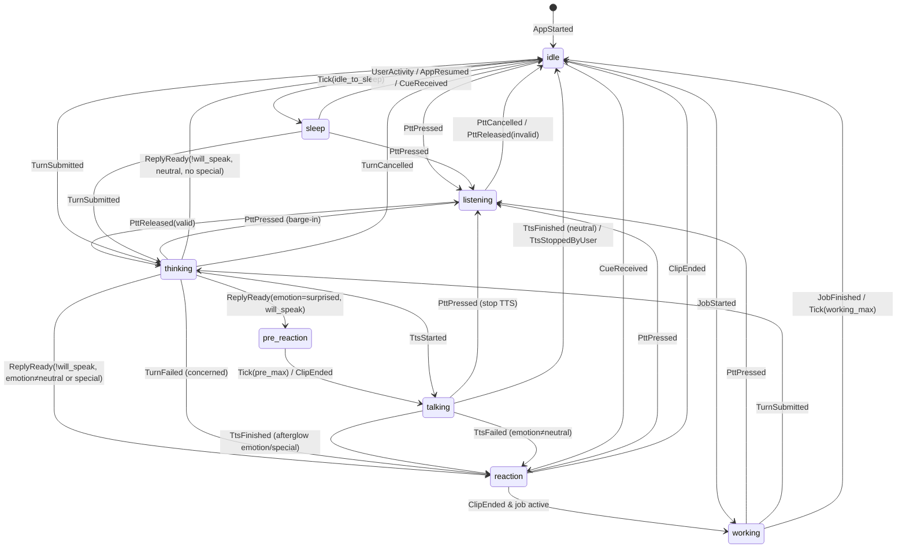

# HANA — CHARACTER SYSTEM

Phiên bản: 1.1 (Phase 1 + Final Decision Patch) · Vị trí canonical: `repo/docs/` · Quyết định chốt: ARCHITECTURE §0.1
Phụ thuộc: `ARCHITECTURE.md` (C2, C3, C8, C15, INV-02, INV-03, INV-05, INV-16, INV-17, INV-18), `AI_PROTOCOL.md` §5, `PRIVACY_SPEC.md` §5.6.

---

## 1. Mục tiêu và ranh giới

Character System biến *ý nghĩa* (Hana đang nghe, đang nghĩ, đang vui, đang ngại…) thành *hình ảnh* (clip video có sẵn), mà không để LLM hay server chạm vào file.

Hai phần tách biệt:

| Phần | Vị trí | Input | Output | KHÔNG ĐƯỢC |
|---|---|---|---|---|
| **Character Director** | Backend (`app/domain/character/director.py`) | Envelope LLM đã validate, mode, sự kiện hệ thống | `CharacterCue` (enum thuần) | Biết asset_id/filename; đọc manifest |
| **Character Engine** | Flutter (`lib/character/engine/`) | `CharacterCue`, sự kiện app (PTT, TTS, turn, lifecycle, thời gian) | `PlayRequest(asset_id, …)` gửi VideoStage | Nhận asset_id/filename từ mạng; đọc private manifest ở normal mode; bật âm thanh video |
| **VideoStage** | Flutter (`lib/character/stage/`) | `PlayRequest` | Pixel trên màn hình | Tự chọn asset; phát audio |
| **Asset Pipeline** | Windows dev (`tools/asset_pipeline/`) | `assets_source/*.MP4` (read-only) + nhãn người duyệt | File app-ready muted + manifest | Ghi vào `assets_source` |

**Nguyên tắc chốt:**

1. LLM chỉ được chọn `emotion` ∈ {neutral, happy, shy, surprised, concerned}, `intensity` ∈ {low, medium, high}, `special_cue` ∈ danh sách semantic cue được phép của mode hiện tại hoặc `null` (INV-02).
2. Các state hoạt động `listening`, `talking`, `thinking`, `working`, `sleep`, `idle` **không bao giờ** do LLM quyết định; chúng đến từ sự kiện app thật (INV-02).
3. Asset được chọn **chỉ** trên client từ manifest bundle/vault đã verify.
4. Mọi video app-ready không có audio stream; mọi player volume 0 (INV-03).

---

## 2. Từ vựng (enum chốt, dùng nguyên văn trong code)

### 2.1 CoreState (10)

| CoreState | Loại | Nguồn kích hoạt | Clip kind |
|---|---|---|---|
| `idle` | activity (nền) | mặc định | loop |
| `listening` | activity | PTT đang giữ | loop |
| `talking` | activity | TTS đang phát | loop |
| `thinking` | activity | turn đã gửi, chưa có reply | loop |
| `happy` | emotion | cue emotion=happy | oneshot (reaction) hoặc loop ngắn |
| `shy` | emotion | cue emotion=shy | oneshot |
| `surprised` | emotion | cue emotion=surprised | oneshot |
| `concerned` | emotion | cue emotion=concerned, lỗi hệ thống | oneshot |
| `working` | activity | job dài do người dùng yêu cầu đang chạy | loop |
| `sleep` | activity | quiet hours + idle, hoặc idle rất lâu | loop |

### 2.2 Emotion (LLM được phép chọn)

`neutral | happy | shy | surprised | concerned` — `neutral` không có clip riêng, nghĩa là "không reaction".

### 2.3 Intensity

`low | medium | high`.

### 2.4 SpecialCue

Chuỗi semantic `snake_case` khớp regex `^[a-z][a-z0-9_]{1,31}$`, được đăng ký trong `cue_registry` của manifest (§4.4). Không phải filename. Ví dụ ứng viên (chốt danh sách thật ở phase phân tích asset): `greeting`, `goodnight`, `celebrate`, `comfort`, `thinking_hard`, `blow_kiss`.

### 2.5 AssetClass

`core` (thuộc 1 CoreState) | `special` (thuộc 1 SpecialCue).

### 2.6 AssetMode

`normal` | `private`.

---

## 3. Dữ liệu nguồn hiện có (khảo sát read-only ngày 2026-09-15)

`assets_source/` chứa **43** file `.MP4`, đặt tên ngẫu nhiên (vd `ARRJ9858.MP4`), không mang nghĩa.

| Nhóm | Độ phân giải | Tỉ lệ | Thời lượng | Số file |
|---|---|---|---|---|
| A | 544×544 | 1:1 | 6.04 s | 17 |
| B | 720×1280 | 9:16 | 10.04 s | 14 |
| C | 768×1168 | ~2:3 | 10.04 s | 12 |

Tất cả: H.264, 24 fps, **có audio AAC stereo** (phải loại bỏ), **có thêm stream mjpeg attached picture** (ảnh bìa — phải loại bỏ).

Hệ quả thiết kế:

- Pipeline PHẢI xóa audio stream và attached picture (§5.2).
- Stage PHẢI hỗ trợ nhiều tỉ lệ bằng `render_mode` theo asset (§5.4).
- Chưa biết clip nào ứng với state nào, clip nào là private → phải có bước gắn nhãn thủ công (§4.2). Chưa gắn nhãn = bị loại (INV-17).

---

## 4. Asset model & pipeline

### 4.1 Luồng

```
assets_source/*.MP4  (IMMUTABLE, read-only)
      │ probe.py  (ffprobe, sha256)                         → asset_analysis/probe.json
      │ contact sheet (ffmpeg thumbnails, chỉ để người duyệt) → asset_analysis/sheets/
      ▼
asset_analysis/labels.yaml  (NGƯỜI duyệt điền tay)
      │ label_check.py  (schema + sha256 khớp + coverage)
      ▼
transcode.py  (ffmpeg, §5.2)          → assets_processed/{normal,private}/{core,special}/…
      ▼
verify.py  (ffprobe: 0 audio, 1 video stream, codec, duration; sha256 output)
      ▼
manifest.py                            → assets_processed/normal_manifest.json
                                          assets_processed/private_manifest.json
      ├─► sync_normal (copy)            → repo/mobile/assets/character/normal/
      └─► publish_private.py (scp/rsync) → server PRIVATE_MEDIA_ROOT/assets/ (chỉ private)
```

Pipeline mở file nguồn ở chế độ đọc; `verify.py` so sha256 của toàn bộ `assets_source` trước và sau khi chạy, khác → fail (INV-16).

### 4.2 `labels.yaml` (người duyệt điền)

```yaml
version: 1
assets:
  - source_file: ARRJ9858.MP4
    source_sha256: "…"          # phải khớp probe.json
    decision: include            # include | reject
    mode: normal                 # normal | private
    class: core                  # core | special
    state: idle                  # bắt buộc nếu class=core (CoreState)
    cue: null                    # bắt buộc nếu class=special (SpecialCue)
    intensity_tags: [low, medium]  # tùy chọn; emotion states dùng để khớp intensity
    kind: loop                   # loop | oneshot
    loop_quality: seamless       # seamless | crossfade (điểm đầu/cuối không khớp)
    trim_start_ms: 0
    trim_end_ms: 0               # cắt bỏ ở cuối (vd frame chuyển cảnh)
    render_mode: cover           # cover | contain_blur
    focal_x: 0.5                 # 0..1, tâm crop khi cover
    focal_y: 0.35
    weight: 1.0                  # trọng số chọn ngẫu nhiên, 0.1..10
    notes: "…"
```

Quy tắc fail-closed (INV-17):

- File trong `assets_source` không có trong `labels.yaml` → loại, cảnh báo.
- `decision` thiếu hoặc khác `include` → loại.
- Có bất kỳ nghi ngờ nội dung nhạy cảm → người duyệt PHẢI đặt `mode: private` hoặc `reject`. Pipeline không tự suy luận mode.
- `mode: private` + `class: core` được phép (biến thể private của core state).
- `label_check.py` PHẢI báo lỗi (exit ≠ 0) nếu thiếu coverage bắt buộc: mỗi CoreState phải có ≥ 1 asset `mode: normal`. Thiếu → build fail, trừ khi `labels.yaml` khai báo `coverage_waiver: [state]` kèm lý do (khi đó engine dùng fallback §11.3).

### 4.3 Asset ID và đường dẫn

- `asset_id` = `{m}.{class}.{state_or_cue}.{nn}` với `m` ∈ {`n`, `p`}, `nn` 2 chữ số theo thứ tự trong labels. Ví dụ: `n.core.idle.01`, `n.special.greeting.01`, `p.core.idle.01`, `p.special.<cue>.01`.
- File: `assets_processed/{normal|private}/{core|special}/{state_or_cue}/{asset_id}.mp4`, poster `{asset_id}.poster.jpg`, poster mờ `{asset_id}.blur.jpg`.
- Tên file nguồn (vd `ARRJ9858`) **chỉ** xuất hiện trong `asset_analysis/` (không ship). Manifest ship không chứa tên nguồn.

### 4.4 Manifest schema

`normal_manifest.json` (bundle) và `private_manifest.json` (chỉ server private) cùng schema:

```json
{
  "schema_version": 1,
  "manifest_mode": "normal",
  "manifest_version": "2026.09.15-1",
  "generated_at": "2026-09-15T08:00:00Z",
  "cue_registry": [
    { "cue": "greeting", "mode": "normal", "cooldown_s": 600, "allowed_in_quiet_hours": false, "llm_selectable": false },
    { "cue": "celebrate", "mode": "normal", "cooldown_s": 600, "allowed_in_quiet_hours": false, "llm_selectable": true }
  ],
  "assets": [
    {
      "asset_id": "n.core.idle.01",
      "mode": "normal",
      "class": "core",
      "state": "idle",
      "cue": null,
      "kind": "loop",
      "loop_quality": "crossfade",
      "path": "normal/core/idle/n.core.idle.01.mp4",
      "poster": "normal/core/idle/n.core.idle.01.poster.jpg",
      "poster_blur": "normal/core/idle/n.core.idle.01.blur.jpg",
      "duration_ms": 10000,
      "width": 720, "height": 1280,
      "render_mode": "cover",
      "focal_x": 0.5, "focal_y": 0.35,
      "intensity_tags": [],
      "weight": 1.0,
      "audio_streams": 0,
      "sha256": "…",
      "bytes": 2345678
    }
  ]
}
```

Ràng buộc validate (cả pipeline và client khi load):

- `manifest_mode = normal` ⇒ mọi asset `mode = normal` và mọi cue `mode = normal`. Vi phạm → client từ chối toàn bộ manifest (không load một phần) và dùng poster tĩnh + log lỗi nghiêm trọng (INV-05).
- `audio_streams` PHẢI = 0 (INV-03). Asset có giá trị khác → client bỏ qua asset đó.
- `path` là đường dẫn tương đối, không chứa `..`, không bắt đầu `/`, chỉ `[a-z0-9._/-]`.
- `cue_registry[].llm_selectable = true` nghĩa là cue được đưa vào danh sách cho LLM chọn (AI_PROTOCOL §5.3). Cue `false` chỉ do engine/director dùng theo sự kiện (vd `greeting` khi mở app đầu ngày).

### 4.5 Phân phối

| Manifest | Nơi ở | Cách client nhận |
|---|---|---|
| normal | `repo/mobile/assets/character/normal/` (asset bundle APK) | đọc qua `rootBundle` lúc khởi động |
| private | server `PRIVATE_MEDIA_ROOT/assets/private_manifest.json` | `GET /v1/private/assets/manifest` (cần private session) |

- Server cũng giữ **bản sao danh sách cue** của cả hai manifest (không cần asset) để Character Director và AI Protocol biết cue nào hợp lệ: `PRIVATE_MEDIA_ROOT/assets/private_cues.json` (chỉ private worker đọc) và `MEDIA_ROOT/character/normal_cues.json` (normal worker đọc). Hai file do pipeline sinh cùng lúc với manifest.
- `GET /v1/assets/normal-manifest/version` trả `manifest_version` server kỳ vọng; client lệch → chỉ log cảnh báo (v1 không hot-update asset).
- `normal_manifest.json` được commit vào repo; file video gitignored và được `sync_normal` copy trước khi build. Build script (`mobile/tool/check_assets.dart`) fail nếu file thiếu hoặc sha256 không khớp.

### 4.6 Private assets

- Không bao giờ nằm trong `repo/mobile/assets/` (INV-05). CI quét APK/AAB: nếu có entry khớp `private/` hoặc asset_id `p.` → fail build.
- Server lưu tại `PRIVATE_MEDIA_ROOT/assets/…`, không có static route.
- Client tải qua `GET /v1/private/assets/{asset_id}` (cần private session), lưu cache mã hóa (PRIVACY_SPEC §5.6).

---

## 5. Media handling rules

### 5.1 Quy tắc tuyệt đối

| # | Quy tắc |
|---|---|
| M1 | File app-ready có **đúng 1 stream**, loại video, codec H.264. Không audio, không subtitle, không data, không attached picture. |
| M2 | Metadata nguồn bị xóa (`-map_metadata -1`, `-map_chapters -1`). |
| M3 | Không upscale. Không thay đổi fps (24). |
| M4 | Mọi `VideoPlayerController` tạo với `VideoPlayerOptions(mixWithOthers: true)` và gọi `setVolume(0.0)` **trước** `play()`. |
| M5 | Không có code path nào gọi `setVolume` với giá trị khác 0. Test grep trong CI. |
| M6 | Âm thanh duy nhất của Hana là TTS qua `just_audio` (VOICE_SPEC). |
| M7 | Video không giữ audio focus; phát TTS không bị video làm gián đoạn và ngược lại. |
| M8 | Không phát file ngoài manifest đã validate. |
| M9 | Private asset chỉ tồn tại dạng giải mã trong `cache/prv_rt/` khi private session mở. |

### 5.2 Transcode (ffmpeg, chốt tham số)

```
ffmpeg -hide_banner -y -i <source> \
  -map 0:v:0 -an -sn -dn -map_metadata -1 -map_chapters -1 \
  [-ss <trim_start>] [-to <duration - trim_end>] \
  -vf "scale='min(iw,1280)':'min(ih,1280)':force_original_aspect_ratio=decrease:force_divisible_by=2,format=yuv420p" \
  -c:v libx264 -profile:v high -level:v 4.0 -preset slow -crf 20 \
  -r 24 -g 12 -keyint_min 12 -sc_threshold 0 \
  -movflags +faststart \
  <output>.mp4
```

- `-map 0:v:0` chọn stream video đầu tiên (không phải mjpeg attached pic — `probe.py` PHẢI xác định index stream video chính bằng `disposition.attached_pic == 0` và dùng index đó thay cho `0:v:0` nếu khác).
- GOP 12 frame (0.5 s) để seek/loop mượt.
- Poster: frame tại 0 ms → JPEG q=3. Poster blur: scale 1/4, `gblur=sigma=20`, JPEG.

### 5.3 Verify (bắt buộc, fail build nếu sai)

Với mỗi output:

1. `ffprobe -show_streams`: số stream = 1, `codec_type=video`, `codec_name=h264`, `pix_fmt=yuv420p`.
2. `ffprobe -select_streams a`: rỗng.
3. `duration_ms` sai lệch ≤ 50 ms so với kỳ vọng sau trim.
4. sha256 ghi vào manifest.
5. Toàn bộ `assets_source` sha256 không đổi.

### 5.4 Rendering

- Stage là vùng tỉ lệ cố định **9:16**, căn giữa, chiếm vùng trên của màn hình chat (chiều cao tối đa 62% viewport; phần còn lại cho chat). Trên màn hình rộng hơn 9:16, stage letterbox bằng màu nền theme.
- `render_mode: cover` → `FittedBox(fit: BoxFit.cover)` với `Alignment` tính từ `focal_x, focal_y` (`Alignment(focal_x*2-1, focal_y*2-1)`).
- `render_mode: contain_blur` → lớp dưới: `poster_blur` phủ kín (cover); lớp trên: video `BoxFit.contain`. Không blur realtime.
- Người duyệt NÊN dùng `contain_blur` cho nhóm A (1:1) và `cover` cho nhóm B/C; quyết định cuối nằm trong `labels.yaml`.

---

## 6. CharacterCue contract (server → client)

### 6.1 Schema

```json
{
  "cue_id": "0192…",                  
  "source": "reply|system|proactive",
  "emotion": "neutral|happy|shy|surprised|concerned",
  "intensity": "low|medium|high",
  "special_cue": null,
  "reason": "reply|turn_failed|stt_empty|report_ready|reminder|proactive"
}
```

Không có field nào khác. Client parser (`CharacterCue.fromJson`) PHẢI:

- Từ chối field lạ (bỏ qua, không lỗi).
- Map giá trị enum không hợp lệ → `neutral`/`low`/`null`.
- Bỏ qua `special_cue` không có trong `cue_registry` của engine hiện tại (normal engine chỉ có normal registry).

### 6.2 Character Director (backend)

`direct(envelope | system_event, mode, cue_catalog) -> CharacterCue`:

1. `emotion` ngoài enum → `neutral`. `intensity` ngoài enum → `low`.
2. `special_cue`:
   - không nằm trong `cue_catalog[mode]` hoặc `llm_selectable=false` → `null`.
   - normal mode chỉ nhận cue có `mode=normal` (catalog normal không bao giờ chứa cue private — INV-05).
3. Sự kiện hệ thống (không qua LLM):

| reason | emotion | intensity | special_cue |
|---|---|---|---|
| `turn_failed` (LLM lỗi) | concerned | low | null |
| `stt_empty` | concerned | low | null |
| `report_ready` | happy | medium | `celebrate` nếu cue có trong catalog normal (bất kể `llm_selectable`), else null |
| `reminder` | neutral | low | null |
| `proactive` | từ envelope proactive | | null nếu không hợp lệ |

4. Director là hàm thuần, có unit test bảng.

---

## 7. Character Engine — input/output

### 7.1 Kiến trúc

- `CharacterEngine` là reducer thuần: `EngineResult reduce(EngineState s, EngineEvent e)` với `EngineResult = (EngineState next, List<EngineEffect> effects)`.
- Clock và RNG được inject (`Clock`, `Random(seed)`), để test tái lập được.
- Timer được biểu diễn bằng effect `ScheduleTick(at, tag)`; khi tới hạn, runtime gửi event `Tick(tag)`.
- Một instance engine cho normal mode (sống suốt app). Private mode tạo **instance mới** với manifest gộp (§13) và hủy khi khóa.

### 7.2 Events (input)

| Event | Phát bởi | Payload |
|---|---|---|
| `AppStarted` | bootstrap | `manifest`, `now_local`, `quiet_hours` |
| `AppPaused` / `AppResumed` | lifecycle | — |
| `UserActivity` | chạm màn hình, gõ phím | — |
| `PttPressed` | voice | — |
| `PttReleased` | voice | `valid: bool` (≥ 400 ms) |
| `PttCancelled` | voice | — |
| `TurnSubmitted` | chat/voice | `turn_id` |
| `TurnProgress` | SSE | `stage` |
| `ReplyReady` | SSE | `turn_id`, `CharacterCue`, `will_speak: bool` |
| `TtsStarted` | audio player | `turn_id` |
| `TtsFinished` | audio player | `turn_id` |
| `TtsFailed` | audio player / SSE | `turn_id` |
| `TtsStoppedByUser` | UI | — |
| `TurnFailed` | SSE | `turn_id`, `CharacterCue` (concerned) |
| `TurnCancelled` | SSE/UI | `turn_id` |
| `JobStarted` / `JobFinished` | SSE `job.started`, polling | `job_id` |
| `CueReceived` | proactive/reminder message mở trong app | `CharacterCue` |
| `QuietHoursChanged` | timer | `in_quiet_hours: bool` |
| `Tick` | runtime | `tag` |
| `ClipEnded` | VideoStage | `asset_id` (oneshot kết thúc) |
| `ClipError` | VideoStage | `asset_id`, `error` |

### 7.3 Effects (output)

| Effect | Ý nghĩa |
|---|---|
| `Play(asset_id, loop: bool, crossfade_ms)` | VideoStage phát |
| `Preload(asset_id)` | chuẩn bị controller dự phòng |
| `ScheduleTick(at, tag)` / `CancelTick(tag)` | hẹn giờ |
| `ReleaseTtsGate` | cho phép AudioPlayer bắt đầu phát TTS (dùng cho pre-speech reaction) |
| `LogEngine(level, code)` | debug |

---

## 8. State machine

### 8.1 Mô hình hai lớp

- **Activity layer** (một giá trị): `idle | listening | thinking | talking | working | sleep`.
- **Overlay layer** (tùy chọn, oneshot): `reaction(emotion, intensity)` hoặc `special(cue)`, có `timing ∈ {pre_speech, post_speech, immediate}`.
- **Visible state** được tính theo độ ưu tiên:

```
listening  >  talking  >  overlay(pre_speech)  >  thinking  >  overlay(immediate|post_speech)  >  working  >  sleep  >  idle
```

`overlay(pre_speech)` chỉ tồn tại trong khoảng giữa `ReplyReady` và bắt đầu TTS.

### 8.2 Sơ đồ



### 8.3 Bảng chuyển trạng thái chi tiết

| Từ | Event | Điều kiện | Tới | Effects |
|---|---|---|---|---|
| bất kỳ | `PttPressed` | — | listening | `Play(listening, loop, 150ms)`; hủy overlay; UI dừng TTS |
| listening | `PttReleased(valid)` | — | thinking | `Play(thinking, loop, 250ms)` |
| listening | `PttReleased(invalid)` / `PttCancelled` | — | idle | `Play(idle, loop, 250ms)` |
| idle, sleep, working, reaction | `TurnSubmitted` | — | thinking | `Play(thinking)`; ghi `thinking_entered_at` |
| thinking | `ReplyReady` | `will_speak` và `timing(emotion)=pre_speech` và có asset | overlay pre_speech | chờ `thinking_min_dwell`; `Play(emotion, oneshot)`; `ScheduleTick(pre_speech_max)`; TTS bị giữ gate |
| thinking | `ReplyReady` | `will_speak`, timing ≠ pre_speech | thinking (chờ) | lưu `pending_overlay` (post_speech); `ReleaseTtsGate` |
| overlay pre_speech | `Tick(pre_speech_max)` hoặc `ClipEnded` | — | (chờ TTS) | `ReleaseTtsGate` |
| thinking / pre | `TtsStarted` | — | talking | `Play(talking, loop, 200ms)` |
| thinking | `ReplyReady` | `!will_speak` và (emotion≠neutral hoặc special) | overlay immediate | chờ `thinking_min_dwell`; `Play(emotion|special, oneshot)` |
| thinking | `ReplyReady` | `!will_speak`, neutral, không special | idle | chờ min dwell; `Play(idle)` |
| talking | `TtsFinished` | có `pending_overlay` | overlay post_speech | `Play(overlay, oneshot)` |
| talking | `TtsFinished` | không | idle | `Play(idle)` |
| talking | `TtsFailed` | — | như `ReplyReady(!will_speak)` | |
| thinking | `TurnFailed` | — | overlay immediate concerned | `Play(concerned, oneshot)` |
| overlay | `ClipEnded` hoặc `Tick(overlay_max)` | job active | working | `Play(working)` |
| overlay | `ClipEnded` hoặc `Tick(overlay_max)` | — | idle | `Play(idle)` |
| idle | `JobStarted` | — | working | `Play(working)`; `ScheduleTick(working_max)` |
| working | `JobFinished` / `Tick(working_max)` | — | idle | `Play(idle)` |
| idle | `Tick(idle_to_sleep)` | — | sleep | `Play(sleep)` |
| sleep | `UserActivity` / `AppResumed` / `CueReceived` | — | idle (rồi xử lý cue) | `Play(idle)` |
| idle | `CueReceived` | cue hợp lệ, không trong cooldown | overlay immediate | `Play(...)` |
| bất kỳ | `AppPaused` | — | giữ state | pause controllers; hủy tick trừ `idle_to_sleep` |
| bất kỳ | `AppResumed` | — | giữ state (sleep → idle) | resume/replay |
| bất kỳ | `ClipError(asset)` | — | giữ state | đánh dấu asset hỏng phiên này; `Play(select lại)` (§11.3) |

Event không có trong bảng cho state hiện tại → bỏ qua (không lỗi). `TtsStarted/Finished` với `turn_id` khác turn hiện tại → bỏ qua.

### 8.4 Tham số thời gian (hằng số trong `engine/config.dart`)

| Tham số | Giá trị |
|---|---|
| `crossfade_default_ms` | 250 |
| `crossfade_listening_ms` | 150 |
| `thinking_min_dwell_ms` | 500 |
| `pre_speech_max_ms` | 1200 |
| `overlay_min_ms` | 1500 |
| `overlay_max_ms` | min(duration clip, 4000) |
| `working_max_ms` | 120000 |
| `idle_to_sleep_quiet_ms` | 60000 (khi trong quiet hours) |
| `idle_to_sleep_day_ms` | 1800000 (30 phút) |
| `thinking_variant_rotate_ms` | 10000 (đổi variant thinking nếu chờ lâu) |
| `proactive_cue_fresh_ms` | 1800000 |

---

## 9. Quy tắc reaction

### 9.1 Timing theo emotion

| Emotion | Có TTS | Không TTS |
|---|---|---|
| surprised | `pre_speech` (tối đa 1200 ms rồi nói) | immediate |
| happy | `post_speech` nếu intensity ≥ medium; low → không overlay | immediate nếu ≥ medium; low → immediate |
| shy | `post_speech` | immediate |
| concerned | `post_speech` nếu intensity ≥ medium; low → không overlay | immediate |
| neutral | không overlay | không overlay |

### 9.2 Special cue vs emotion

- Một reply tối đa **1 overlay**. Nếu có `special_cue` hợp lệ và không trong cooldown → special thay thế emotion overlay, timing = `post_speech` (có TTS) hoặc `immediate`.
- Special cue trong quiet hours chỉ phát nếu registry `allowed_in_quiet_hours = true`.
- Cooldown theo cue (`cooldown_s`), lưu trong engine state (RAM).

### 9.3 Intensity khớp asset

Khi chọn asset cho emotion state: ưu tiên asset có `intensity_tags` chứa intensity yêu cầu; không có → mọi asset của state đó.

### 9.4 Cue từ tin nhắn không phải turn

- Proactive message chưa đọc, tuổi < `proactive_cue_fresh_ms` khi mở app → `CueReceived` một lần (đánh dấu đã phát theo message_id trong RAM + drift).
- Mở app lần đầu trong ngày local (so với lần mở trước lưu trong drift) → `CueReceived(special=greeting)` nếu registry có `greeting`, else `happy low`.
- Reminder đến giờ khi app foreground → `CueReceived(neutral)` (không overlay) — chỉ đánh thức từ sleep.

---

## 10. Special videos

- Là asset `class: special`, `kind: oneshot`, gắn một `cue`.
- Nguồn kích hoạt: (a) LLM chọn trong danh sách `llm_selectable` của mode hiện tại; (b) Director cho sự kiện hệ thống; (c) Engine cho sự kiện app (`greeting`).
- Normal engine chỉ có registry normal. Private engine có registry normal + private.
- Cue hợp lệ nhưng không có asset khả dụng (hỏng/thiếu) → dùng emotion overlay của reply; nếu emotion neutral → không overlay.

---

## 11. Thuật toán chọn asset

### 11.1 Candidate pool

```
pool(state_or_cue, mode_ctx) =
  assets.where(a =>
      a.class matches (core+state | special+cue)
   && a.mode in allowed_modes(mode_ctx)       // normal ctx: {normal}; private ctx: {private, normal}
   && !broken_this_session.contains(a.asset_id)
   && a.audio_streams == 0)
```

Private ctx: nếu tồn tại asset `mode=private` cho state đó → pool chỉ gồm private assets của state đó; ngược lại dùng normal assets.

### 11.2 Chọn

1. Lọc theo `intensity_tags` (§9.3) nếu áp dụng.
2. Loại asset đã phát gần nhất cho cùng state/cue (cửa sổ 1; nếu pool có ≥ 4 asset thì cửa sổ 2), trừ khi pool chỉ còn 1.
3. Weighted random theo `weight` với RNG inject.
4. Với loop: khi clip còn `crossfade_default_ms` đến hết, chọn lại theo cùng thuật toán (có thể ra chính nó nếu pool = 1) và crossfade; `loop_quality = seamless` và pool = 1 → dùng `setLooping(true)` không crossfade.

### 11.3 Fallback chain (INV-18)

```
pool(state) rỗng
  → pool(idle)
  → poster của asset idle đầu tiên trong manifest (ảnh tĩnh)
  → màu nền + placeholder silhouette bundle (assets/character/fallback.png)
```

Emotion/special không có asset → bỏ overlay (không fallback sang idle clip mới, giữ clip đang chạy).

---

## 12. VideoStage (playback)

- 2 `VideoPlayerController` (slot A, B) + opacity crossfade. Slot đang hiển thị = front; slot kia = back để preload.
- `Play(asset)`: nếu back đã preload đúng asset → `play`, animate opacity; nếu chưa → `initialize` (timeout 1500 ms) rồi phát. Trong lúc initialize, front tiếp tục chạy.
- Sau crossfade: dispose controller cũ nếu asset khác, giữ nếu có thể tái sử dụng.
- Tối đa 3 controller đồng thời (A, B + 1 preload cho `listening` luôn sẵn sàng vì cần phản hồi nhanh nhất).
- Nguồn: normal → `VideoPlayerController.asset(path)`; private → `VideoPlayerController.file(File(prv_rt/…))`.
- `AppPaused` → pause tất cả; `AppResumed` → play front.
- Không bao giờ hiển thị khung đen: widget poster của asset hiện tại nằm dưới video làm nền.
- `ClipError` khi initialize/play → event về engine.

---

## 13. Chuyển mode

| Bước | Normal → Private | Private → Normal (khóa) |
|---|---|---|
| 1 | Private session hợp lệ (PRIVACY_SPEC §5.3) | Hủy private engine instance, dispose controllers private |
| 2 | Tải/giải mã private manifest vào RAM | Xóa `cache/prv_rt/` (giải mã), xóa manifest khỏi RAM |
| 3 | Tạo private engine: manifest = normal assets ∪ private assets, registry = normal ∪ private | Normal engine tiếp tục (đã tạm dừng khi vào private) từ `idle` |
| 4 | Normal engine pause (không nhận event) | Không event nào của private được replay vào normal engine |
| 5 | Stage private là widget riêng trong route `/private` | Route private bị pop hoàn toàn khỏi navigator |

Normal engine **không bao giờ** nhận private manifest, private cue, hay `CharacterCue` từ SSE private (SSE private chỉ nối vào private engine).

---

## 14. Failure modes

| Sự cố | Hành vi |
|---|---|
| Manifest normal lỗi schema / chứa asset private | Từ chối manifest, stage hiển thị `fallback.png`, log critical, app vẫn chat được |
| File asset thiếu / sha256 sai (kiểm tra lazy lần phát đầu cho mỗi asset) | `broken_this_session`, chọn lại |
| Decoder lỗi (thiết bị không hỗ trợ profile) | Như trên; nếu mọi asset lỗi → poster tĩnh |
| Cue lạ từ server | Bỏ qua |
| `TtsStarted` không đến sau `ReplyReady(will_speak)` trong 8 s | Engine `Tick(tts_wait_timeout)` → coi như `TtsFailed` |
| Nhiều event dồn dập (PTT nhấn-nhả liên tục) | Reducer xử lý tuần tự; crossfade đang chạy bị thay thế bởi Play mới (hủy animation cũ) |
| Private session hết hạn khi đang phát private clip | Khóa → §13 cột phải |
| Hết bộ nhớ khi init controller | Giảm về 2 controller, bỏ preload listening |

---

## 15. Invariants áp dụng

INV-02, INV-03, INV-05, INV-16, INV-17, INV-18 (xem ARCHITECTURE §13), cộng:

| ID | Invariant |
|---|---|
| CHR-01 | Visible state luôn là một trong 10 CoreState hoặc một special cue hợp lệ của mode hiện tại. |
| CHR-02 | `listening` hiển thị ≤ 250 ms sau `PttPressed` (p95). |
| CHR-03 | Không bao giờ có 2 overlay cho cùng một reply. |
| CHR-04 | Normal engine instance không bao giờ giữ tham chiếu tới asset `mode=private`. |
| CHR-05 | Engine reducer không thực hiện I/O. |

---

## 16. Yêu cầu kiểm thử

- Unit test reducer: mọi dòng trong bảng §8.3, với FakeClock + seeded RNG.
- Property test: chuỗi event ngẫu nhiên 10.000 bước → CHR-01, CHR-03, CHR-04 luôn đúng; không exception.
- Test Director: bảng §6.2 + fuzz chuỗi emotion/cue bất kỳ → output luôn hợp lệ.
- Pipeline test: file mẫu có audio + attached pic → output 1 stream video; `assets_source` checksum không đổi.
- Manifest validator test: manifest normal chứa asset `p.` → bị từ chối.
- Widget test VideoStage: controller nhận `setVolume(0)` trước `play`; `mixWithOthers=true`.
- CI grep: không có `setVolume(` với đối số khác `0` / `0.0` trong `lib/`.
- CI APK scan: không có asset private.
